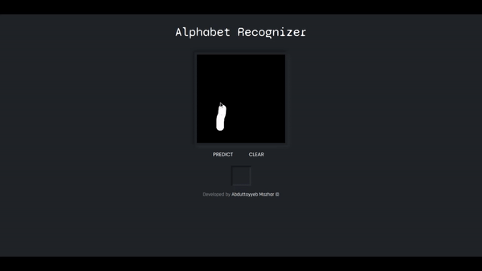

# Alphabet-Recognition-EMNIST
An Alphabet/Letter Recognizer using EMNIST(Extended-MNIST) Dataset.

| **Source**  | **URL** |
| ------------- | ------------- |
| Demo / WebApp  | https://alphanum-vision.herokuapp.com/ |
| Code  | https://www.kaggle.com/abtabm/alphabet-letter-recognition-emnist-balanced  |
 

- **App.py** consists of "EMNIST-Balanced-Model.h5" model which is not added in the repository, by visiting the Kaggle Notebook URL, one can try out the code and download the model with their required specifications, so as to avoid version errors while deploying over web.

